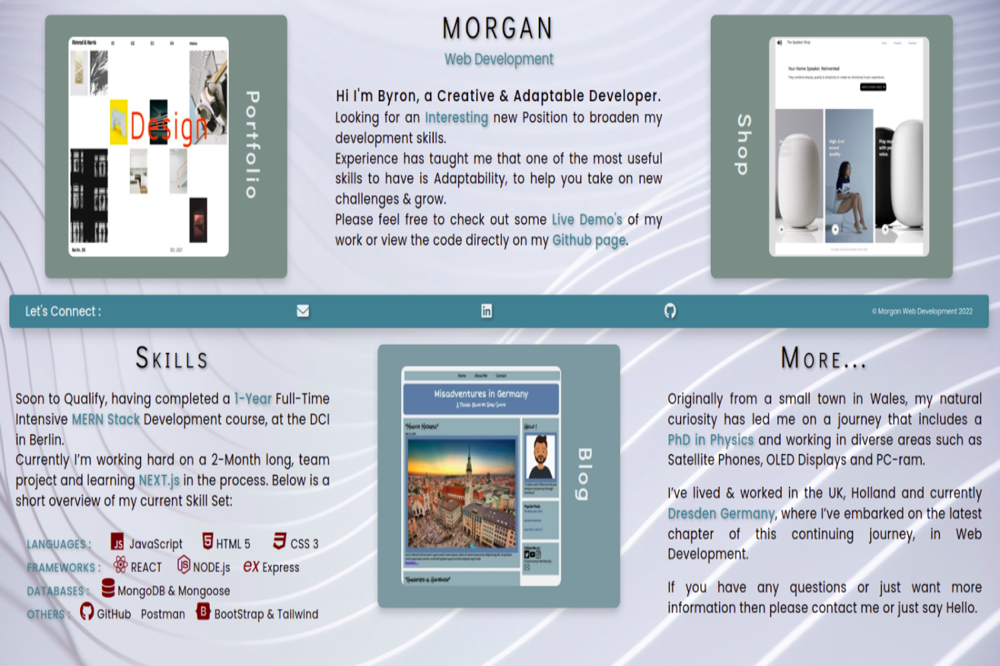

# Single Page Portfolio

A single-page portfolio site with project cards, skills, and a contact form.

## Description

This project is intentionally lightweight and static: plain HTML, CSS, and a small JavaScript file. It presents the essentials of a CV-style portfolio without extra navigation or build tooling. The UI includes a dark/light theme toggle, animated section reveals, tooltip skill badges, and an inline contact form powered by Formspree.

## Main Page

## Getting Started

Open `index.html` directly in a browser, or use a simple static server like the VS Code Live Server extension. No Node.js runtime or build step is required for the site itself.

## Notes

The contact form posts to Formspree. Update the `action` URL in `index.html` if you want messages delivered to a different inbox.

---

 &copy; Morgan Web Development 2026

---
