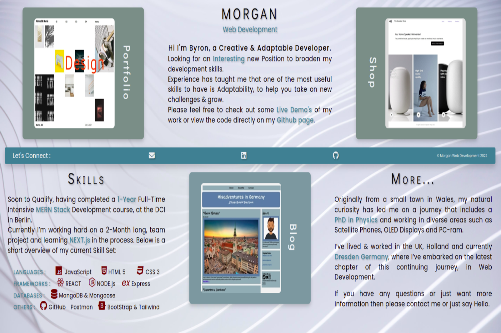

# Single Page Portfolio

A One Page Portfolio Site, with contact & current project links.

## Description :

Yes, you've got me, this site really is just a single page of HTML 5 with a CSS 3 file. It was intentional really !

For me this was a short experiment in simplicity. I wanted to see just how simply I could produce a portfolio site.

As a portfolio is essentially an online Profile or CV.
I thought, why not make it like a simple one-page flyer or CV,
instead of a site where you have to spend time scrolling through or finding your way around multiple menus.

All the essentials are immediately visible and easy to read or see. Obviously there's not enough space on one page to go into real details about everything, just the essentials.

I decided to extend this simplicity to the rest of the project. So a simple structure, simple UI and simple deployment.

This meant no frameworks, no animation, no menus and no scrolling to find information.

The Result is shown below in a screen shot. I hope you enjoy the simplicity.

## Main Page :

#

( Single Page Screen Shot )

&copy; Morgan Web Development 2022

#
